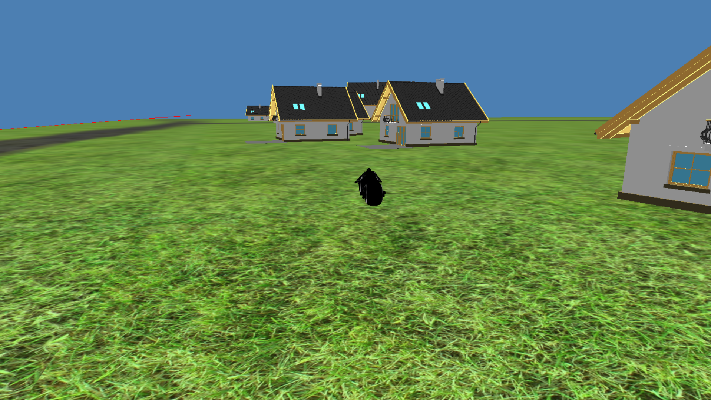

# Animation Rendering System.
In that project I realized technologies like:
1. OpenGL.
2. Classes: animation, window, math library (vectors, matrixes, camera), stock system.
3. Unit system: timer, control and input.
4. Resourses: models, textures, materials and sounds.
5. Shaders.

## How to use:
You need to download this repository to your pc, download opengl libraries on your computer and run.

If you want to create your animation unit, you can create classes like in "ctrl.h" or "test.h" with constructor, Response, destructor and Render functions.
Than include your h-file in main.cpp and write this command WinMain:

``` C++ 
ani_sys.Units.Add(new mk5::your_class_unit); 
```

Example of opportunities of Animation system.


